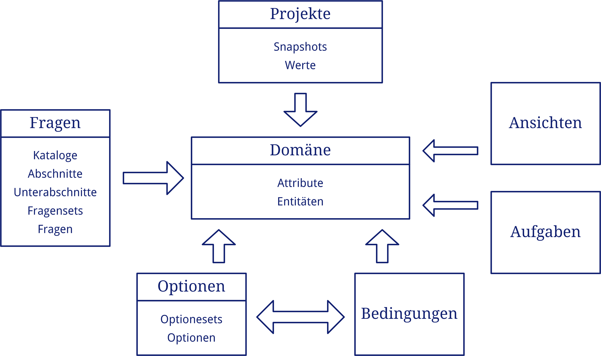

class: center, middle

.logo[
    
]

# Abschlussworkshop

7\. April 2017

[rdmorganiser.github.io](https://rdmorganiser.github.io)

---

class: center, middle, inverted

Begrüßung
---------

#### Harry Enke

---

RDMO Team
----

.team[
    
    
    
    
    
    
]

.small.center[
  Claudia Engelhardt (FHP) &ndash; Jochen Klar (AIP) &ndash; Martin Heger (FHP, Masterstudent)
]
.small.center[
  Harry Enke (AIP) &ndash; Heike Neuroth (FHP) &ndash; Jens Ludwig (DINI/nestor AG)
]

<table class="partner">
    <tr>
        <td class="image"></td>
        <td class="image"></td>
        <td class="image"></td>
    </tr>
</table>

---

Agenda
------

11:00 Uhr Begrüßung

11:10 Uhr RDMO Projektpräsentation

* Konzept (Jens Ludwig)
* Projektergebnisse (Claudia Engelhardt und Jochen Klar)

12:00 Uhr RDMO Erfahrungsberichte

* bwFDM-info (Frank Tristram, Joe Gain, Christoph Oßner)
* Universität Stuttgart (Florian Fritze)
* Göttingen eResearch Alliance (Jessica Rücknagel)

12:45 Uhr Mittagsimbiss

---

Agenda
------

13:30 Uhr Erfahrungsberichte anderer Tools

* Universität Bielefeld (Cord Wiljes)
* DMPRoadmap (Thilo Paul-Stüve)

14:10 Uhr UAG DMP der DINI/nestor AG Forschungsdaten (Kerstin Helbig)

14:30 Uhr Kaffeepause

15:00 Uhr Zusammenarbeit in der Community (Diskussion)

16:00 Uhr Ende

---

class: center, middle

.logo[
    
]

## Konzept

#### Jens Ludwig

---

class: inverted, background-image
background-image: url(img/wrench.jpg)

## Projektergebnis: Software/Werkzeug

.attribution[
  <a href="https://commons.wikimedia.org/wiki/User:Yiyi">Dario Crespi</a>, <a href="https://commons.wikimedia.org/wiki/File:Open-ended_wrench.JPG">Open-ended wrench</a>, <a href="https://creativecommons.org/licenses/by-sa/4.0/legalcode">CC BY-SA 4.0</a>
]

---

class: inverted, background-image
background-image: url(img/nuts.jpg)

## Zweck des Werkzeugs: Forschungsdatenmanagement unterstützen

---

class: inverted, background-image

## Zweck: DMPs als Teil eines Drittmittelantrags

[Bild von unsinniger Verwendung eines Nagels und Schraubenschlüssel]

---

class: inverted, background-image

## Zweck: FDM-Aufgaben durch Information und Planung unterstützen

Aufgaben für verschiedene Zwecke und Akteure im Projekt

[Bild: verschiedene Muttern an verschiedenen Fahrrädern, verschiedene Stellen, Klimzugstange, Gashahn, Stromkasten]

---

class: inverted, background-image

## Zweck: FDM-Aufgaben durch Information und Planung unterstützen

"actionable DMPs": Aufgaben durch andere Systeme ausführen lassen

[Bild von Fahrrad mit zwei Schraubenschlüsseln]

---

class: inverted, background-image

## Zweck: FDM-Aufgaben durch Information und Planung unterstützen

"active DMPs": Aufgaben und Informationen während des Projekts anpassen

[Fahrrad im Park]

---

class: inverted, background-image

## typischer Fehler: DMPs als Erkenntnis-Projekt und möglichst detailliert

[Bild von ganz vielen unnützen Schrauben in einem Holzstück]

---

class: inverted, background-image

RDMO statt DMP-Werkzeug
-----------------------

[Bild von Schraubenschlüssel-Set]

---

class: center, middle

.logo[
    
]

## Projektergebnisse

#### Claudia Engelhardt und Jochen Klar

---

Fragenkatalog
-------------

* Ausgangsbasis: WissGrid-Checkliste und weitere Quellen
* Erarbeitung eines generischen Fragenkatalogs
  * Logische Strukturierung
  * Verknüpfung von Fragen, Antwortoptionen, Ansichten und Aufgaben
  * Hilfetexte und Links zu weiteren Informationen
* Ausloten disziplinspezifische Anpassungsbedarfs
  * Astrophysik
  * Sozialwissenschaften
* Kompatibilität mit Datenmodellen
  * CERIF, Kerndatensatz Forschung, CASRAI (Masterarbeit M. Heger)

---

Fragenkatalog - Inhalt
----------------------

* Allgemeine Informationen zum Projekt
* Inhaltliche Einordnung der Daten
* Technische Einordnung der Daten
* Datennutzung
* Metadaten und Referenzierung
* Rechtliche und ethische Aspekte
* Speicherung und Langzeitarchivierung

---

Software
--------

* Realisierung einer Webanwendung auf Basis von:
  * Python und dem [Django Framework](https://www.djangoproject.com)
  * JavaScript und [AngularJS 1](https://angularjs.org)
  * [Bootstap 3](http://getbootstrap.com/)
  * [Font Awesome](http://fontawesome.io)
  * [Pandoc](http://pandoc.org)
* Nutzung einer relationalen Datenbank (MySQL, PostgreSQL, Oracle, SQLite)
* Schnittstellen (LDAP, Shibboleth, OAuth)
* Zentrale Demo-Instanz auf https://rdmo.aip.de

---

Open Source
-----------

* Offene Entwicklung seit dem *ersten Tag*
* Apache 2.0 Lizenz
* Code auf GitHub unter https://github.com/rdmorganiser/rdmo
* Dokumentation http://rdmo.readthedocs.io
* Tests mit [Travis CI](https://travis-ci.org/rdmorganiser/rdmo) und [Coveralls](https://coveralls.io/github/rdmorganiser/rdmo)
* Releases mit GitHub
* DOI mit Zenodo

---

Community und Nutzertests
-------------------------

* User-Tests:
  * [Arbeitsgruppe Sonnenphysik](http://www.aip.de/en/research/research-area-cmf/cosmic-magnetic-fields/solar-physics/optical-solar-physics)/[GREGOR Telekop](https://gregor.aip.de/) am AIP
  * [TwinLife](http://www.twin-life.de/) am DIW
* Vernetzung:
  * DataWiz, eRA, GESIS, UB Heidelberg, UB Duisburg Essen
  * bwFDM-info, gfbio, Digitale Hochschule NRW
  * DINI/nestor-AG "Forschungsdaten"
* Input-Workshop am 27.6.2016
* Seminar WS 2015/2016 an der FHP

---

class: center, middle, inverted

RDMO Tour
---------

### Nutzerperspektive

[rdmo.aip.de](https://rdmo.aip.de)

---

class: inverted

RDMO Nutzerperspektive
----------------------

* Zugang per lokalem Account, Oauth, LDAP Anbindung, Shibboleth
* Strukturierung anhand von Projekten
* Strukturiertes Interview
  * verschiedene Widgets, kontollierte Vokabulare, Hilfetexte, Navigation
  * Reiter für verschiedene Projektpartner, Förderer, Datensätze, etc.
  * Bedingungen und Überspringen von Fragen
* Anzeigen und Export der Antworten und von Ansichten
* Erstellen von Snapshots
* Hinzufügen von Mitgliedern zu Projekten
* Aufgaben

---

RDMO Architektur
----------------

.architecture[
    
]

---

class: center, middle, inverted

RDMO Tour
---------

### Betreiberperspektive

[rdmo.aip.de](https://rdmo.aip.de)

---

class: inverted

RDMO Betreiberperspektive
-------------------------

* Domäne
  * Attribute und Entitäten
  * Bereiche, Anzeigenamen, Optionen, Bedingungen
* Optionen und Optionensets
* Bedingungen
* Fragen
  * Kataloge, Abschnitte und Unterabschnitte
  * Fragensets und Fragen
* Ansichten
* Aufgaben

---

Import/Export
-------------

* Interoperabilität zwischen den RDMO-Instanzen
* Export URLs für Betreiber:
  * Domäne, Optionen, Bedingungen, Fragenkatalog, Ansichten, Aufgaben
* Export für Nutzende:
  * Projekt mit Snapshots und Antworten
* Import zur Zeit über Kommandozeile
* URI zur Identifikation einzelner Elemente
* RDMO Fragenkatalog: [github.com/rdmorganiser/rdmo-catalog](https://github.com/rdmorganiser/rdmo-catalog)

---

RDMO XML Format
---------------

```xml
<catalog xmlns:dc="http://purl.org/dc/elements/1.1/">
  <dc:uri>https://rdmorganiser.github.io/terms/questions/rdmo</dc:uri>
  <dc:comment/>
  <order>1</order>
  <title lang="en">RDMO</title>
  <title lang="de">RDMO</title>
  <sections>
    <section>
      <dc:uri>https://rdmorganiser.github.io/terms/questions/rdmo/general</dc:uri>
      <dc:comment/>
      <order>0</order>
      <title lang="en">General</title>
      <title lang="de">Allgemein</title>
      <subsections>
        <subsection>
        <dc:uri>https://rdmorganiser.github.io/terms/questions/rdmo/general/topic</dc:uri>
        <dc:comment/>
        <order>0</order>
        ...
```

---

Themes
------

* Lokale Anpassungen für eigenes *Look and Feel*
* Kein Fork des `rdmo` Repositories nötig
* Jedes HTML-Template und jede CSS Datei kann überschrieben werden

---

Zusammenarbeit
--------------

* Webseite: [rdmorganiser.github.io](https://rdmorganiser.github.io)
* GitHub Organisation: [github.com/rdmorganiser](https://github.com/rdmorganiser)
* RDMO Quellcode: [github.com/rdmorganiser/rdmo](https://github.com/rdmorganiser/rdmo)
* Fagenkatalog: [github.com/rdmorganiser/rdmo-catalog](https://github.com/rdmorganiser/rdmo-catalog)
* Dokumentation: [rdmo.readthedocs.io](http://rdmo.readthedocs.io)


* Mailingliste: DMPW@LISTSERV.DFN.DE
* GitHub Issues: [github.com/rdmorganiser/rdmo/issues](https://github.com/rdmorganiser/rdmo/issues)
* Slack: [rdmo.slack.com](https://rdmo.slack.com)


* Demo: [rdmo.aip.de](https://rdmo.aip.de)

---

class: inverted

Zusammenfassung
---------------

.summary[
* Organisation des Datenmanagements über die gesamte Projektlaufzeit
* Einbindung aller involvierten Stakeholder
* Abfragen der relevanten Informationen über ein strukturiertes Interview
* Abrufen der Informationen über verschiedene Exporte
* Hohe Anpassbarkeit an institutionelles und fachspezifische Umfeld
* Einfache Installation
]

---

class: center, middle, inverted

Vielen Dank für die Aufmerksamkeit
----------------------------------

[https://rdmorganizer.github.io/talks/abschlussworkshop](https://rdmorganizer.github.com/talks/abschlussworkshop)
