class: center, middle

.logo[
    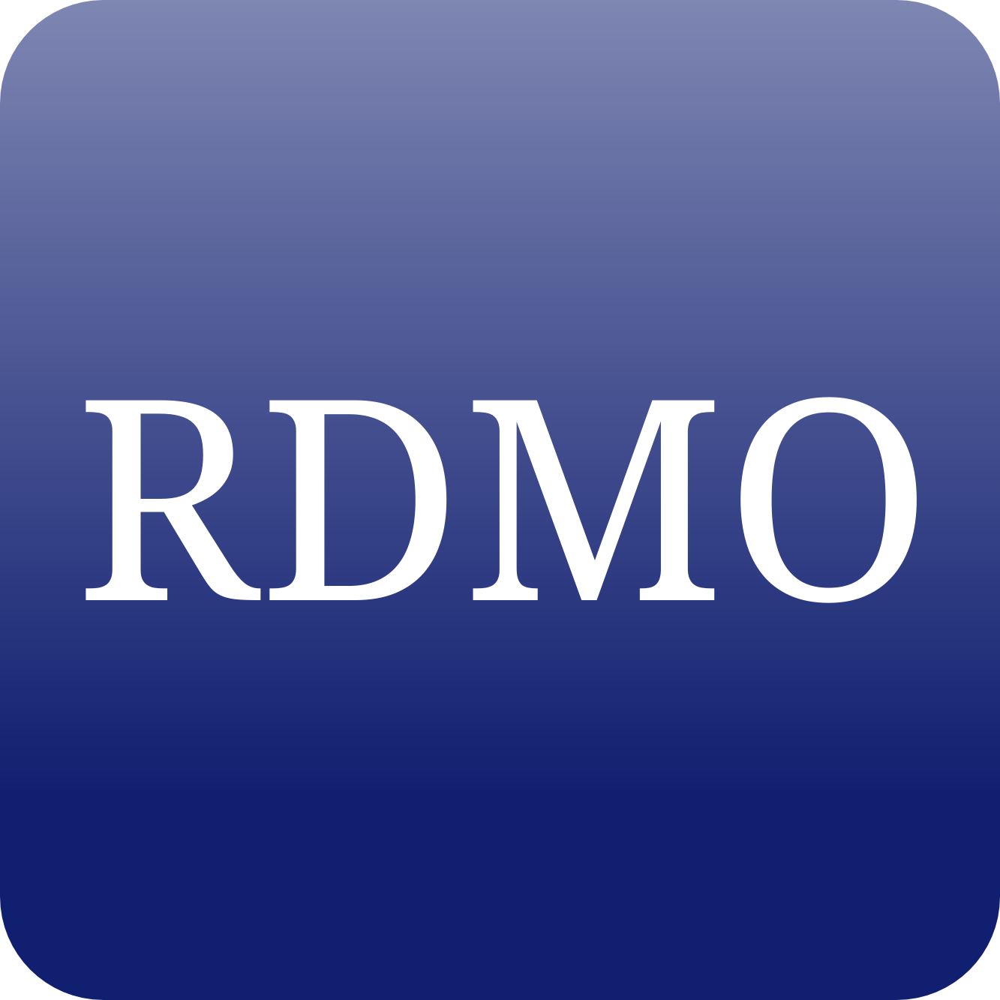
]

# Research Data Management Organiser

### Jochen Klar

[Leibniz-Institut für Astrophysik Potsdam (AIP)](http://www.aip.de)

[rdmorganiser.github.io](https://rdmorganiser.github.io)

---

Project RDMO
------------

  
  

* Funded by the German Research Foundation (DFG)
* November 2015 - April 2017
* Follow-up project planned

### Team

.team[
    
    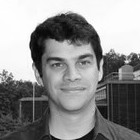
    
    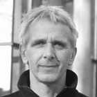
    
    
]

.small.center[
  Claudia Engelhardt (FHP) &ndash; Jochen Klar (AIP) &ndash; Martin Heger (FHP, Master student)
]
.small.center[
  Harry Enke (AIP) &ndash; Heike Neuroth (FHP) &ndash; Jens Ludwig (DINI/nestor AG)
]
---

Project RDMO
------------

.aim[
    We develop a tool to support the systematic planning, organisation and implementation of research data management throughout the course of a project. An additional feature will be the output of a data management plan in the form of a text document.
]

---

Project RDMO
------------

<table class="history">
    <tr>
        <td class="image"><em class="serif">FDMP-Werkzeug</em></td>
        <td class="arrow"><em class="serif">&#8594;</em></td>
        <td class="image"></td>
        <td class="arrow"><em class="serif">&#8594;</em></td>
        <td class="image"></td>
    </tr>
</table>

---

Why RDMO?
---------

.agenda[
    
]

#### Organizer instead of plan

* Organize the data management over the whole lifetime  of a project and beyond
* Involve all stakeholders involved in data management

#### Local instead of central

* Full customization of the content
  * institutional context
  * research field
* Easily deployable for universities, institutes, infrastructures, collaborations ...

.attribution[
    Image credit: <a href="https://en.wikipedia.org/wiki/nl:Gebruiker:Michiel1972">M.Minderhoud</a>, <a href="https://commons.wikimedia.org/wiki/File:Agenda.jpg">Agenda</a>, <a href="https://creativecommons.org/licenses/by-sa/3.0/legalcode">CC BY-SA 3.0</a>
]

---

Software
--------

* Wep application based on Python, Django, AngularJS and Pandoc
* Authentication with LDAP, Shibboleth, OAuth
* Demo-Instance available at https://rdmo.aip.de

### Open Source

* Open-Source development from day one, Apache 2.0 License
* Code on GitHub at https://github.com/rdmorganiser/rdmo
* Documentation at http://rdmo.readthedocs.io
* Tests with [Travis CI](https://travis-ci.org/rdmorganiser/rdmo) and [Coveralls](https://coveralls.io/github/rdmorganiser/rdmo), Releases with GitHub, DOI with Zenodo

---

Concept and Community
---------------------

* Update of the work done in the WissGrid context
* Structure of the questionnaire
  * Sequence of questions, what to skip?
  * Templates for DMP output
  * Internationalization (English, German)
* User tests with
  * [Solar physics group](http://www.aip.de/en/research/research-area-cmf/cosmic-magnetic-fields/solar-physics/optical-solar-physics)/[GREGOR Telescope](https://gregor.aip.de/) at AIP
  * [TwinLife](http://www.twin-life.de/) at DIW
* Workshops with various partner projects/institutions
* Exchange with GFBio, bwFDM, DMPRoadmap, (German-) DMP community

---

.screen[
    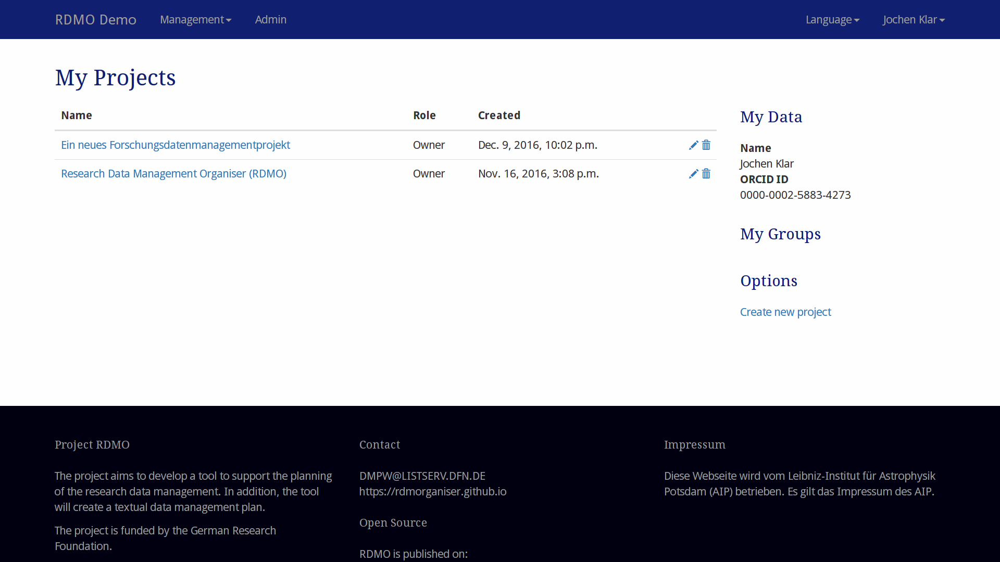
]

---

.screen[
    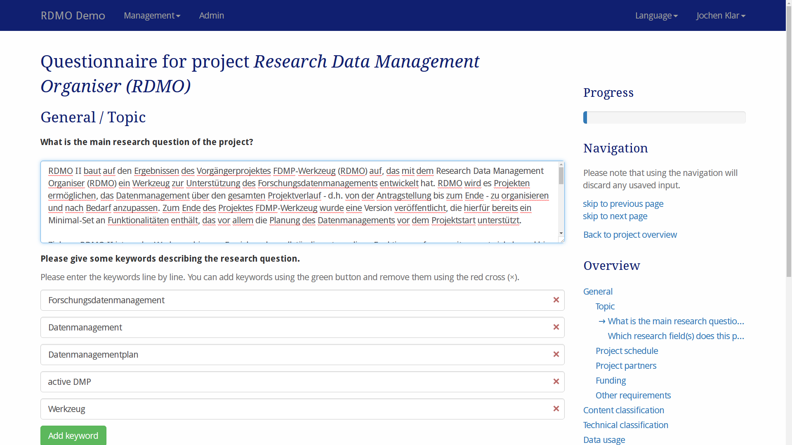
]

---

.screen[
    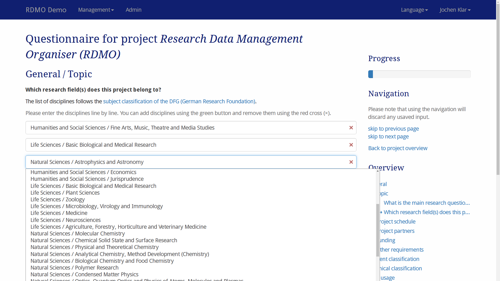
]

---

.screen[
    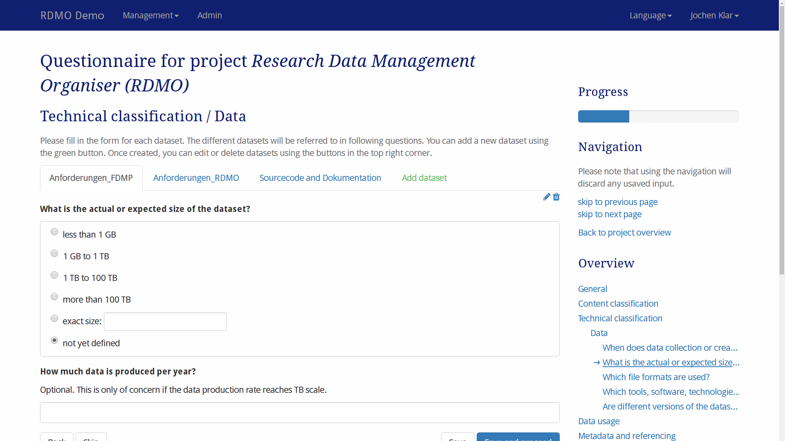
]

---

.screen[
    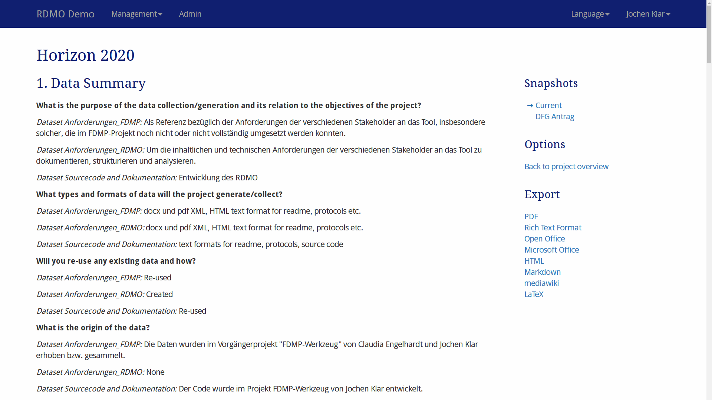
]

---

RDMO Architecture
-----------------

.architecture[
    
]

---

.screen[
    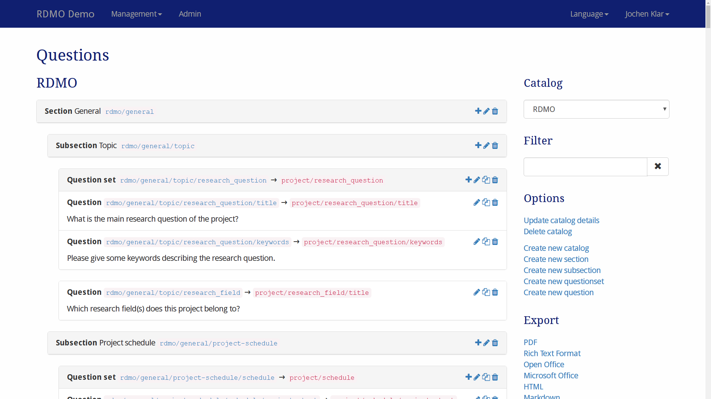
]

---

.screen[
    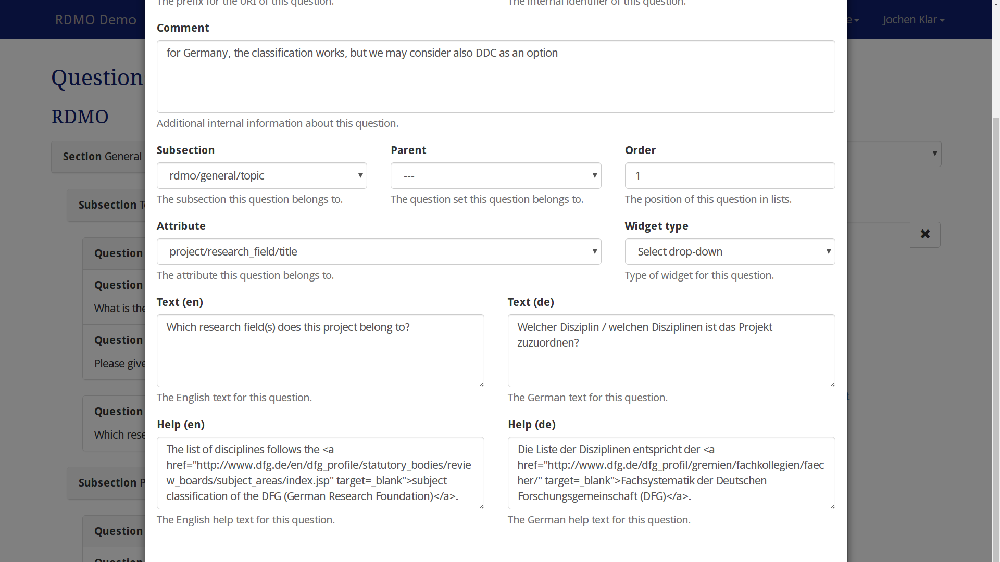
]

---

.screen[
    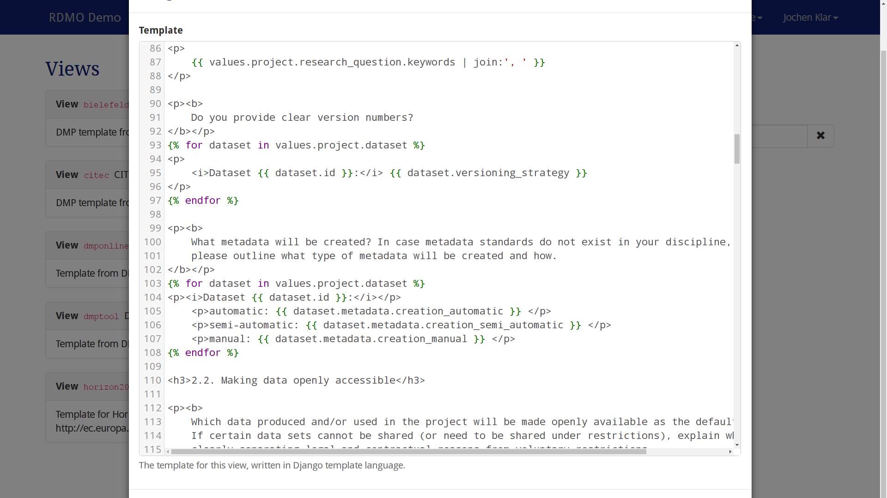
]

---

Who will use RDMO
-----------------

* Leibniz-Institute for Astrophysics (AIP)
* Göttingen eResearch Alliance (eRA)
* bwFDM-info
  * Karlsruhe Institute of Technology
  * University of Konstanz
  * Universität Stuttgart
* University of Duisburg-Essen

--
* ...

.uncle-sam[
    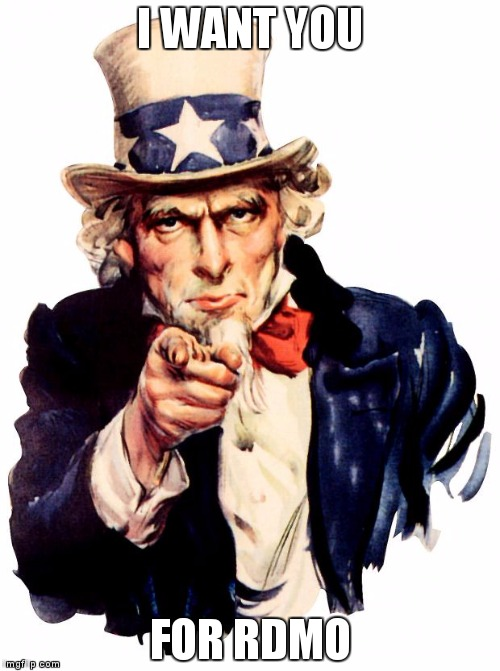
]

---

Get involved!
-------------

* Website: [rdmorganiser.github.io](https://rdmorganiser.github.io)
* GitHub organization: [github.com/rdmorganiser](https://github.com/rdmorganiser)
* RDMO application: [github.com/rdmorganiser/rdmo](https://github.com/rdmorganiser/rdmo)
* Generic questionaire: [github.com/rdmorganiser/rdmo-catalog](https://github.com/rdmorganiser/rdmo-catalog)
* Documentation: [rdmo.readthedocs.io](http://rdmo.readthedocs.io)

* Demo: [rdmo.aip.de](https://rdmo.aip.de)

* Mailinglist: DMPW@LISTSERV.DFN.DE
* GitHub issues: [github.com/rdmorganiser/rdmo/issues](https://github.com/rdmorganiser/rdmo/issues)

---

class: inverted

RDMO aims
---------

* to organize the data management over the whole lifetime of a project
* to involve all stakeholders involved in data management
* to use a structured interview to enter all information needed for a
sustainable data management
* to provide various ways to retrieve and utilize the entered data
* to be highly customizable for local or field-specific requirements
* to be easily deployable within any institution

--

* Slides: [https://rdmorganiser.github.io/talks/egu2017](https://rdmorganiser.github.io/talks/egu2017)
* Contact: jklar@aip.de, [@jochenklar](https://twitter.com/jochenklar)
